# cangjie-project 模块

cangjie-project 是仓颉语言 IntelliJ 插件的核心项目管理模块，负责项目模型定义、项目解析、依赖管理和构建系统集成。

## 一、仓颉项目模型设计

### 1.1 核心模型层次

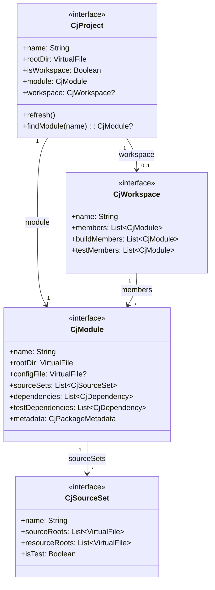

### 1.2 依赖模型

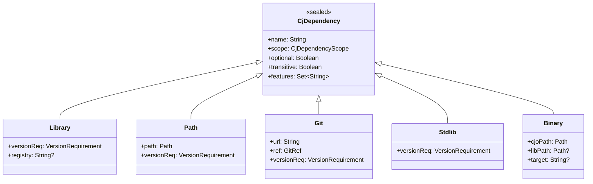

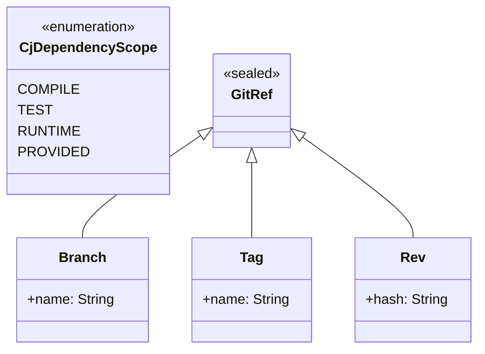

### 1.3 包模型

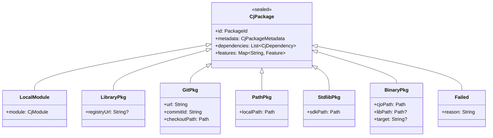

### 1.4 依赖图模型

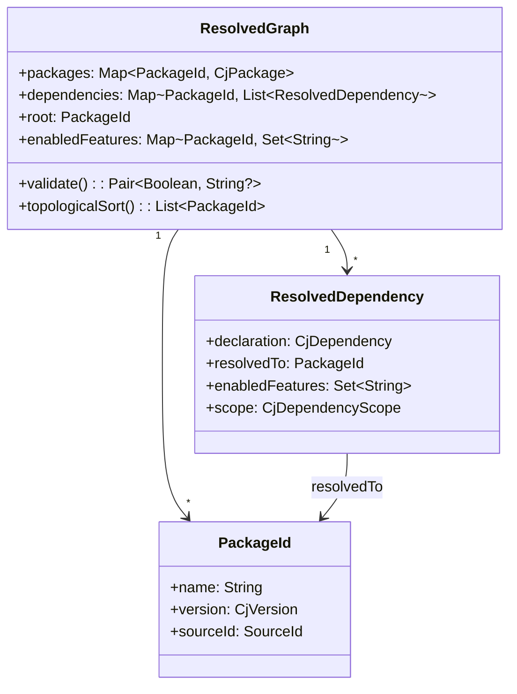

---

## 二、项目解析流程

### 2.1 项目发现流程

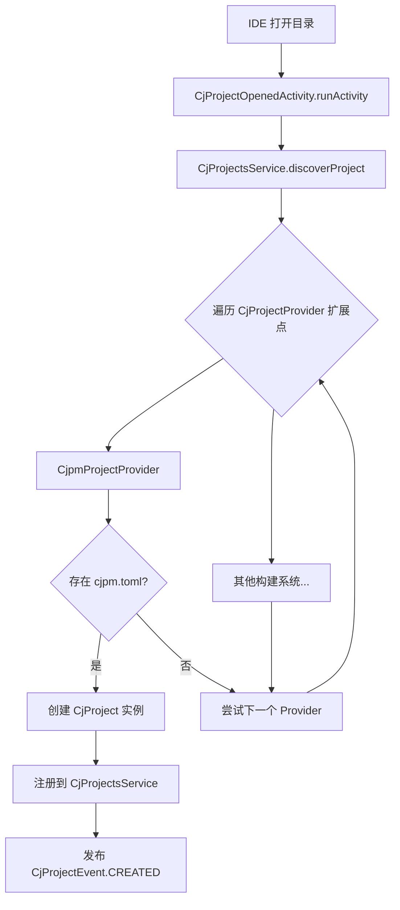

### 2.2 配置解析流程

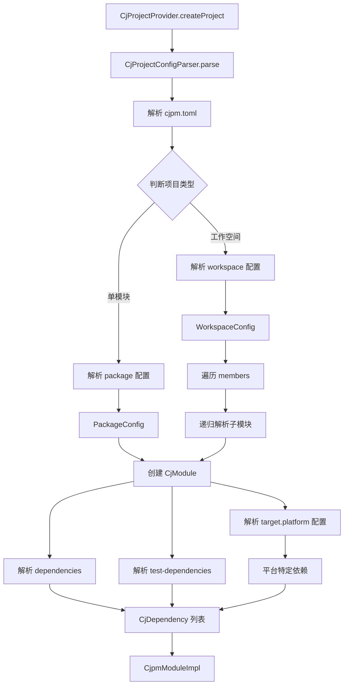

### 2.3 依赖解析流程

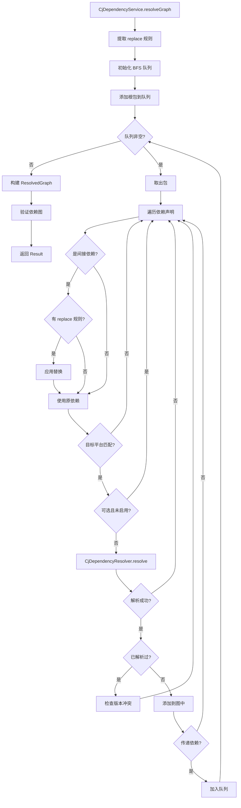

### 2.4 依赖解析器选择

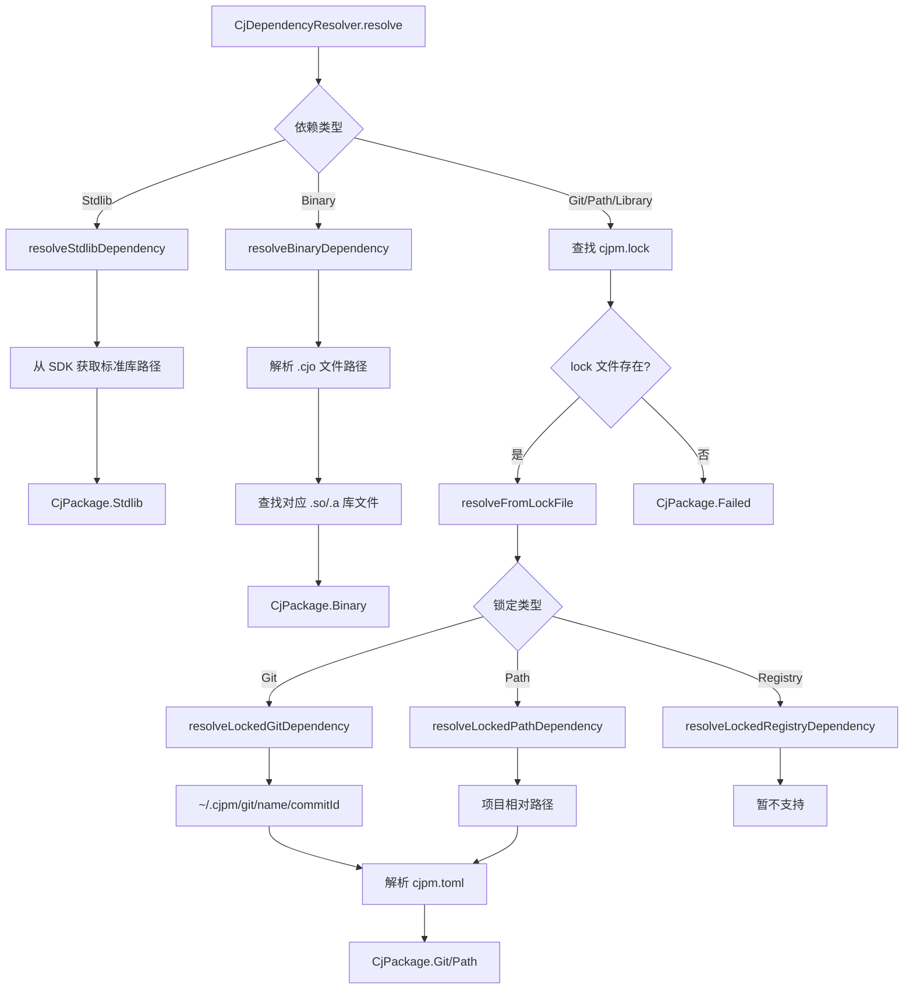

### 2.5 项目同步流程

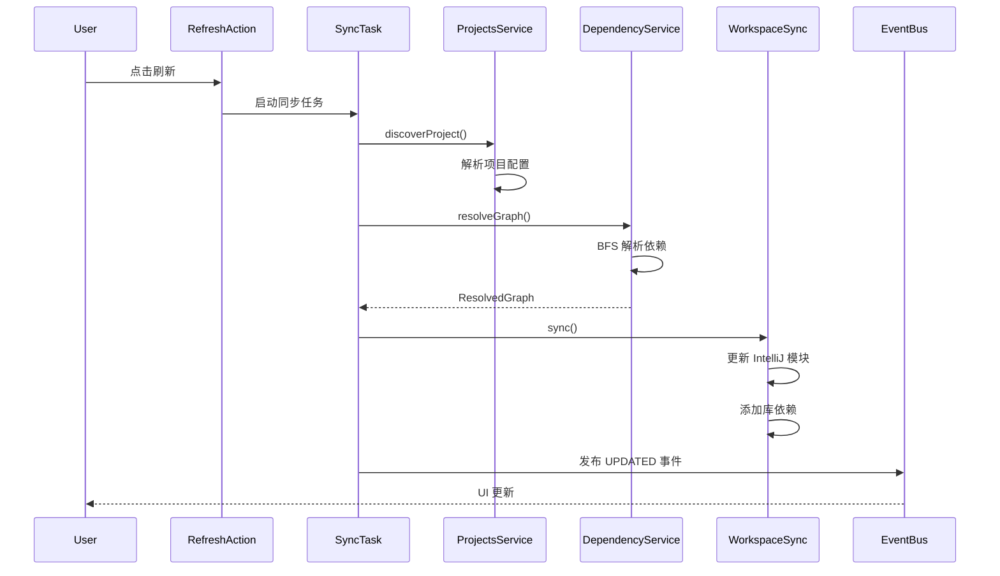

---

## 三、层级架构

### 3.1 模块分层

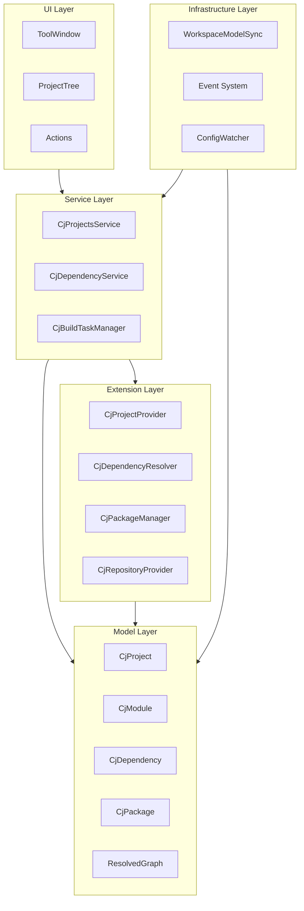

### 3.2 包结构

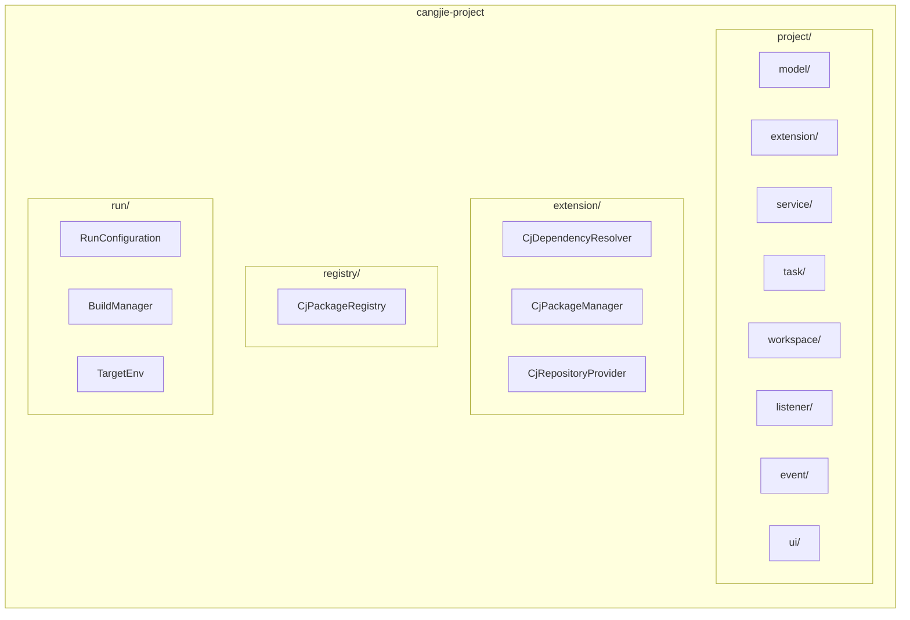

### 3.3 扩展点机制

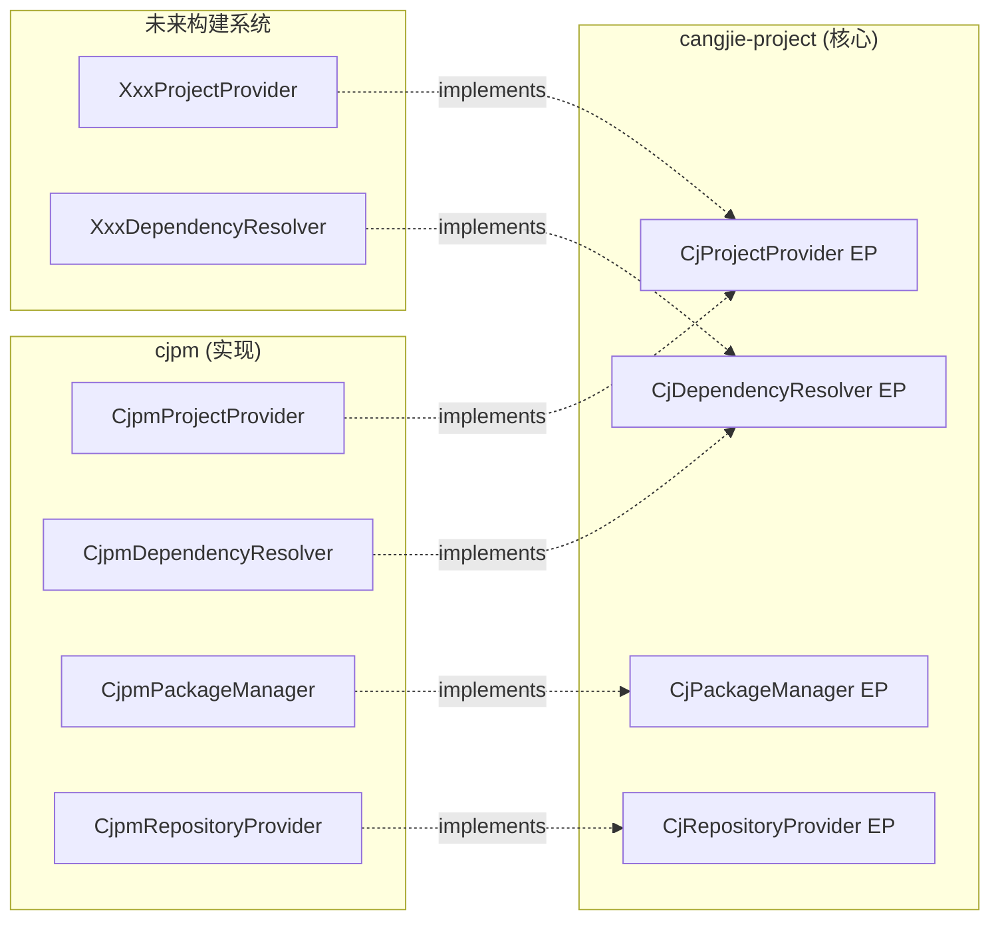

### 3.4 事件系统

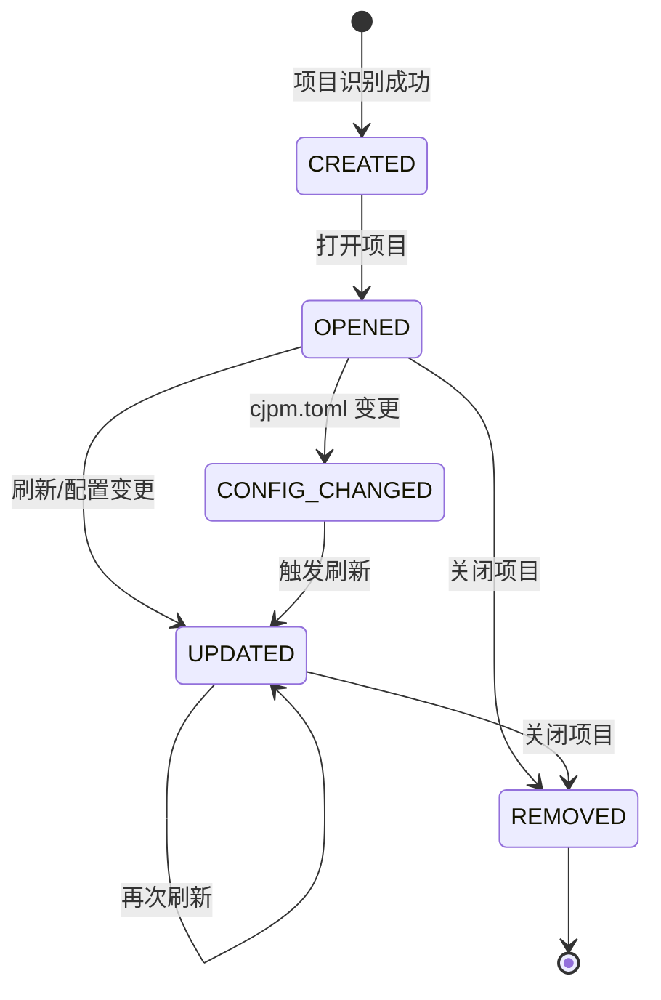

---

## 四、与其他模块的关系

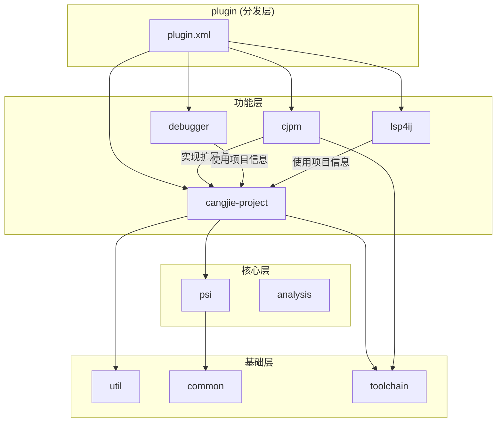

### 依赖关系说明

| 模块        | 关系  | 说明                                             |
|-----------|-----|------------------------------------------------|
| cjpm      | 实现者 | 实现 CjProjectProvider、CjDependencyResolver 等扩展点 |
| psi       | 依赖  | 使用语法解析支持                                       |
| debugger  | 消费者 | 使用项目信息进行调试配置                                   |
| lsp4ij    | 消费者 | 使用项目信息配置 LSP                                   |
| toolchain | 依赖  | 使用 SDK 和工具链信息                                  |

---

## 五、关键设计决策

### 5.1 Project Model 优先架构

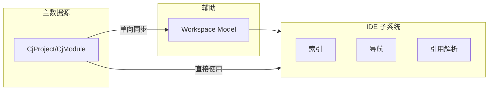

### 5.2 依赖解析缓存策略

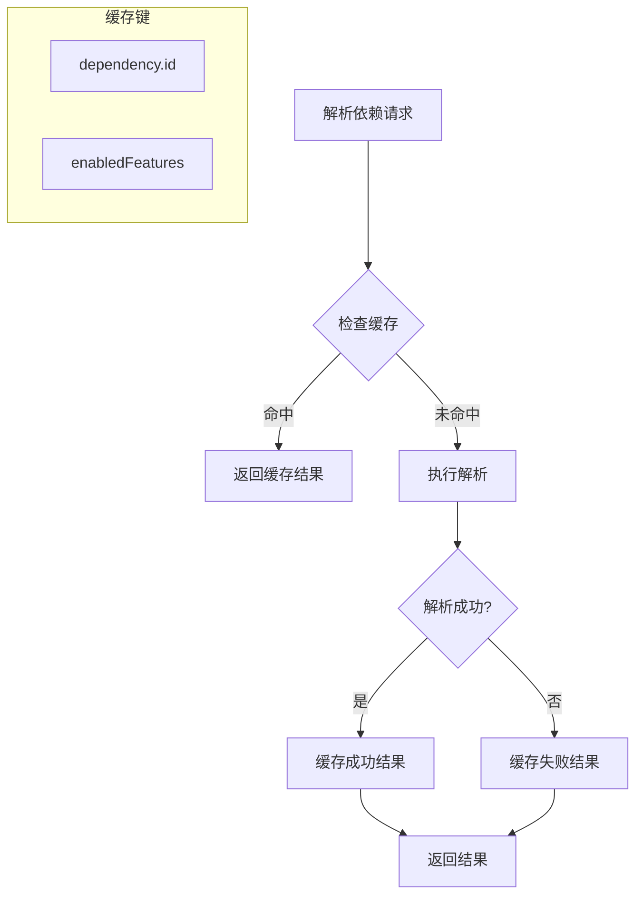

### 5.3 Replace 规则应用

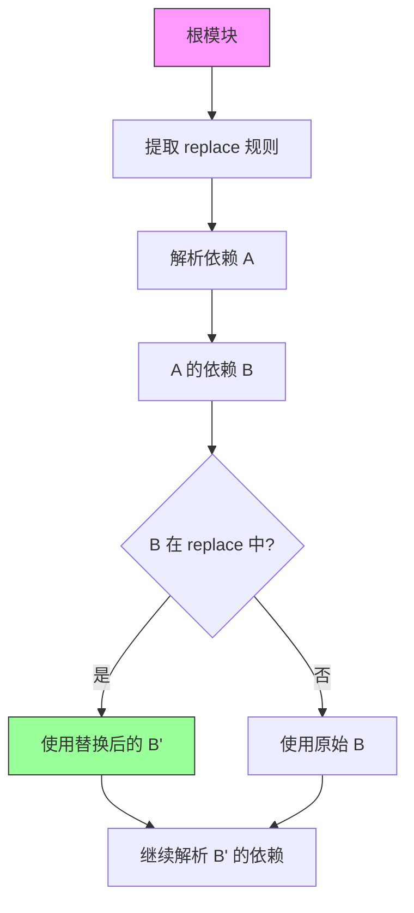

---

## 六、配置文件格式

### cjpm.toml 结构

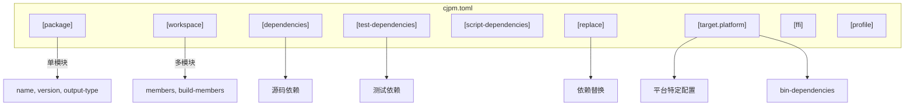