# 仓颉项目模型设计文档 (v2.0)

> 本文档基于代码扫描生成，准确反映 `cangjie-project` 和 `cjpm` 模块的实际实现状态
>
> 最后更新：2025-12-03

## 目录

1. [模块概览](#1-模块概览)
2. [核心模型接口](#2-核心模型接口)
3. [项目模型接口](#3-项目模型接口)
4. [依赖模型设计](#4-依赖模型设计)
5. [依赖图管理](#5-依赖图管理)
6. [扩展点架构](#6-扩展点架构)
7. [服务层设计](#7-服务层设计)
8. [CJPM 实现](#8-cjpm-实现)
9. [数据流和交互](#9-数据流和交互)
10. [已知问题](#10-已知问题)
11. [实现状态](#11-实现状态)

---

## 1. 模块概览

### 1.1 模块结构

项目由两个主要模块组成：

```
intellij-cangjie/
├── cangjie-project/          # 核心模块 (~82个文件)
│   ├── model/                # 核心模型接口
│   ├── extension/            # 扩展点定义
│   ├── project/              # 项目相关模型和服务
│   ├── service/              # 服务层
│   ├── event/                # 事件系统
│   ├── registry/             # 包注册表
│   ├── run/                  # 运行配置
│   └── ui/                   # UI 组件
│
└── cjpm/                     # CJPM 实现模块 (~44个文件)
    ├── dependency/           # 依赖解析实现
    ├── project/              # 项目模型实现
    ├── config/               # 配置解析
    ├── toml/                 # TOML 支持
    ├── build/                # 构建支持
    ├── wizard/               # 项目向导
    └── actions/              # 用户操作
```

### 1.2 模块职责划分

| 模块                  | 职责         | 关键特性                        |
|---------------------|------------|-----------------------------|
| **cangjie-project** | 定义核心接口和抽象  | ExtensionPoint、Service、抽象模型 |
| **cjpm**            | 实现CJPM构建系统 | CjpmProjectImpl、依赖解析、TOML解析 |

---

## 2. 核心模型接口

### 2.1 依赖模型 (model 包)

#### 2.1.1 CjDependency (Sealed Class)

**位置**: `cangjie-project/src/main/kotlin/org/cangnova/cangjie/model/CjDependency.kt`

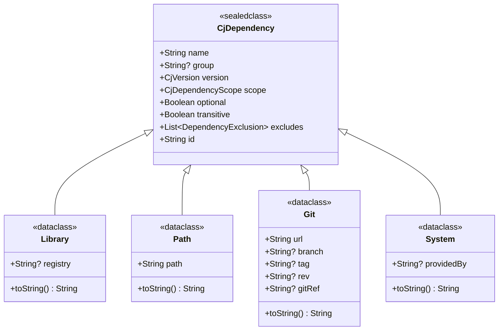

**四种依赖类型**：

| 类型        | 用途        | group | transitive 默认值 | 特殊属性                  |
|-----------|-----------|-------|----------------|-----------------------|
| `Library` | 外部库依赖     | 可选    | true           | registry              |
| `Path`    | 本地路径/模块依赖 | null  | false          | path                  |
| `Git`     | Git仓库依赖   | null  | true           | url, branch, tag, rev |
| `System`  | 系统/标准库依赖  | null  | false          | providedBy            |

#### 2.1.2 CjDependencyScope (Enum)

**⚠️ 重要提示：存在两个同名的 CjDependencyScope**

1. **`org.cangnova.cangjie.model.CjDependencyScope`** (第一个)
    - 文件：`model/CjDependency.kt` 第30行
    - 用途：用于 `CjDependency` sealed class
    - 值：COMPILE, RUNTIME, TEST, PROVIDED

2. **`org.cangnova.cangjie.project.model.CjDependencyScope`** (第二个)
    - 文件：`project/model/CjModule.kt` 第118行
    - 用途：用于 `CjModuleDependency` 数据类
    - 值：COMPILE, TEST, RUNTIME, PROVIDED (顺序略有不同)

**转换函数**：`CjModule.kt:80-87` 提供了 `toModuleScope()` 扩展函数用于在两者之间转换

#### 2.1.3 DependencyExclusion (Data Class)

```kotlin
data class DependencyExclusion(
    val group: String?,     // 依赖组（可选）
    val name: String        // 依赖名称
) {
    fun matches(dependency: CjDependency): Boolean
    override fun toString(): String
}
```

#### 2.1.4 CjResolvedDependency (Interface)

```kotlin
interface CjResolvedDependency {
    val dependency: CjDependency
    val resolvedPackage: CjPackage?
    val resolvedLibrary: CjLibrary?
    val transitiveDependencies: List<CjDependency>
    val isResolved: Boolean
    val errorMessage: String?
}
```

**实现类**：`CjpmResolvedDependency` (cjpm模块)

- 工厂方法：`resolvedAsPackage()`, `resolvedAsLibrary()`, `failed()`

#### 2.1.5 CjPackage (Interface)

```kotlin
interface CjPackage {
    val name: String
    val group: String?
    val version: CjVersion
    val description: String?
    val authors: List<String>
    val license: String?
    val repositoryUrl: String?
    val dependencies: List<CjDependency>
    val localPath: Path?
}
```

**实现类**：`CjpmPackage` (cjpm模块)

#### 2.1.6 CjLibrary (Interface)

```kotlin
interface CjLibrary {
    val name: String
    val version: CjVersion
    val libraryPath: Path
    val libraryType: CjLibraryType  // STATIC, DYNAMIC, COMPILED
    val sourcePath: Path?
    val documentationPath: Path?
}
```

**实现类**：`CjpmLibrary` (cjpm模块)

#### 2.1.7 CjVersion (Data Class)

```kotlin
data class CjVersion(
    val versionString: String
) : Comparable<CjVersion> {
    val major: Int
    val minor: Int
    val patch: Int
    val preRelease: String?
    val buildMetadata: String?
}
```

支持语义化版本 (Semver) 和版本比较。

---

## 3. 项目模型接口

### 3.1 CjProject (Interface)

**位置**: `cangjie-project/src/main/kotlin/org/cangnova/cangjie/project/model/CjProject.kt`

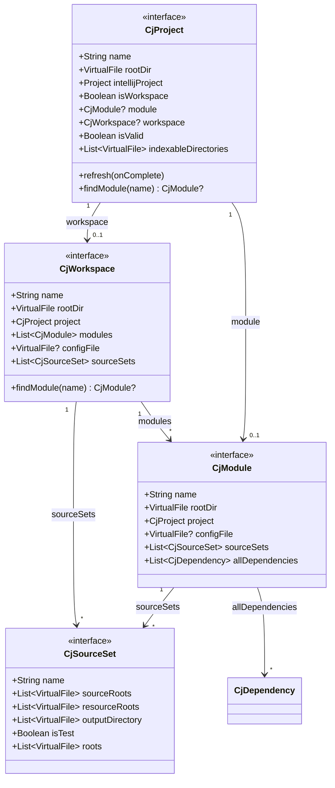

**项目类型**：

- **单模块项目**：`isWorkspace = false`, `module != null`, `workspace = null`
- **工作空间项目**：`isWorkspace = true`, `module = null`, `workspace != null`

### 3.2 CjModule (Interface)

```kotlin
interface CjModule {
    val name: String
    val rootDir: VirtualFile
    val project: CjProject
    val configFile: VirtualFile?
    val sourceSets: List<CjSourceSet>

    // 新设计：统一的依赖列表
    val allDependencies: List<CjDependency>  // ✅ 推荐使用

    // 旧设计：已废弃
    @Deprecated("Use allDependencies instead")
    val dependencies: List<CjModuleDependency>  // ⚠️ 向后兼容
}
```

**便捷扩展属性** (定义在 `CjModule.kt:90-110`)：

```kotlin
val CjModule.libraryDependencies: List<CjDependency.Library>
val CjModule.pathDependencies: List<CjDependency.Path>
val CjModule.gitDependencies: List<CjDependency.Git>
val CjModule.systemDependencies: List<CjDependency.System>
```

### 3.3 CjModuleDependency (Data Class) - 已废弃

```kotlin
@Deprecated("Use CjDependency.Path instead")
data class CjModuleDependency(
    val moduleName: String,
    val scope: CjDependencyScope,  // 注意：这是 project.model 包的 CjDependencyScope
    val exported: Boolean
)
```

---

## 4. 依赖模型设计

### 4.1 依赖类型对比

| 特性             | Library          | Path   | Git                   | System     |
|----------------|------------------|--------|-----------------------|------------|
| **典型用途**       | Maven/NPM式依赖     | 工作空间模块 | GitHub依赖              | 标准库        |
| **group**      | 可选               | null   | null                  | null       |
| **transitive** | true             | false  | true                  | false      |
| **optional**   | 支持               | 支持     | 支持                    | false      |
| **excludes**   | 支持               | 支持     | 支持                    | 空列表        |
| **特殊字段**       | registry         | path   | url, branch, tag, rev | providedBy |
| **缓存位置**       | ~/.cjpm/registry | 项目内    | ~/.cjpm/git           | 工具链提供      |

### 4.2 依赖解析流程

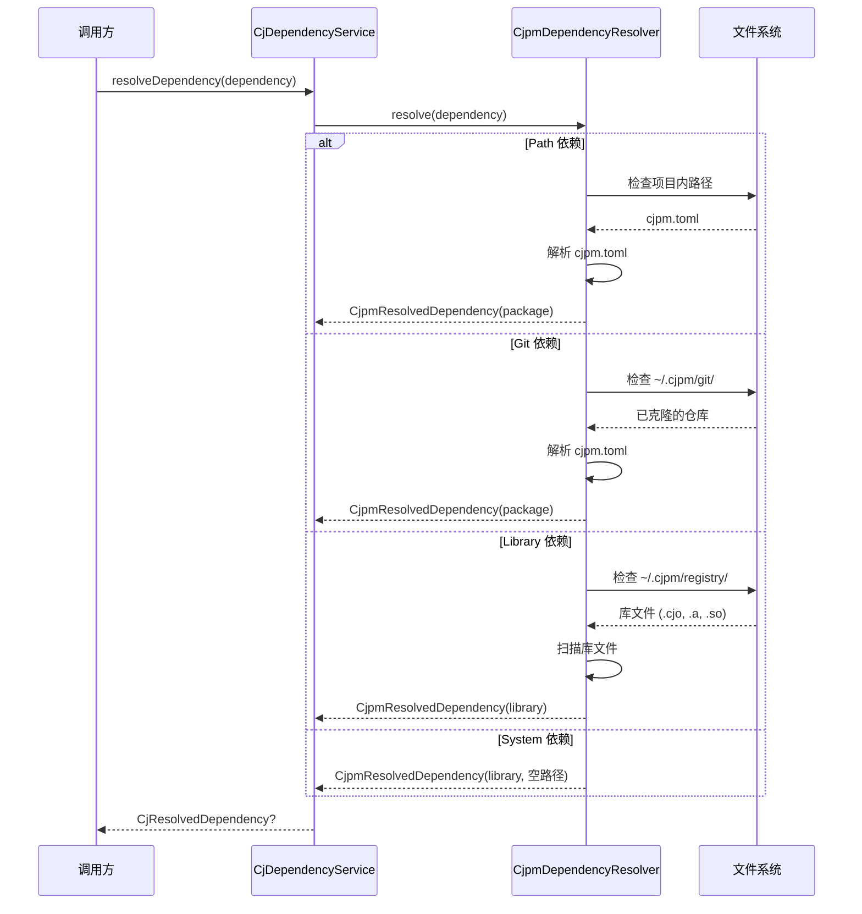

### 4.3 依赖解析策略

#### 4.3.1 Path 依赖解析

1. 相对于项目根目录解析路径
2. 检查目录是否存在
3. 查找 `cjpm.toml` 文件
4. 解析包信息
5. 可选：解析传递依赖

#### 4.3.2 Git 依赖解析

1. 在 `~/.cjpm/git/` 中查找
2. 查找规则：
    - 优先使用依赖名称
    - 尝试 URL 的最后部分（去掉 `.git`）
3. 如果未找到，返回错误（建议运行 `cjpm update`）
4. 解析 `cjpm.toml`

#### 4.3.3 Library 依赖解析

1. 在 `~/.cjpm/registry/<name>-<version>` 中查找
2. 扫描库文件：`.cjo`, `.a`, `.so`, `.dll`, `.dylib`
3. 查找源码目录（如果存在）
4. 解析传递依赖（如果有 `cjpm.toml`）

#### 4.3.4 System 依赖解析

直接返回成功，实际路径由工具链提供。

---

## 5. 依赖图管理

### 5.1 依赖图数据结构

**位置**: `cangjie-project/src/main/kotlin/org/cangnova/cangjie/model/DependencyGraph.kt`

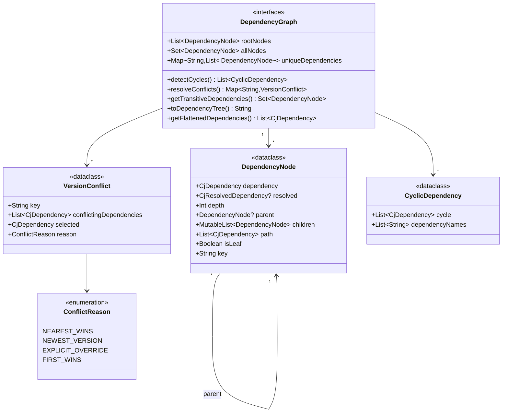

### 5.2 循环依赖检测

使用深度优先搜索 (DFS) 算法：

```kotlin
fun detectCycles(): List<CyclicDependency> {
    val cycles = mutableListOf<CyclicDependency>()
    val visited = mutableSetOf<String>()
    val recursionStack = mutableSetOf<String>()
    val currentPath = mutableListOf<DependencyNode>()

    fun dfs(node: DependencyNode) {
        visited.add(node.key)
        recursionStack.add(node.key)
        currentPath.add(node)

        for (child in node.children) {
            if (!visited.contains(child.key)) {
                dfs(child)
            } else if (recursionStack.contains(child.key)) {
                // 发现循环！
                val cycleStartIndex = currentPath.indexOfFirst { it.key == child.key }
                val cyclePath = currentPath.subList(cycleStartIndex, currentPath.size)
                    .map { it.dependency }
                cycles.add(CyclicDependency(cyclePath + child.dependency))
            }
        }

        recursionStack.remove(node.key)
        currentPath.removeAt(currentPath.size - 1)
    }

    rootNodes.forEach { if (!visited.contains(it.key)) dfs(it) }
    return cycles
}
```

### 5.3 版本冲突解决

#### 策略 1: 最近优先 (Nearest Wins)

选择依赖深度最小的版本：

```
Project
├─ lib-a:1.0  (depth=0) ← 选中
└─ lib-x
   └─ lib-a:2.0  (depth=1)
```

#### 策略 2: 最新版本优先 (Newest Version)

深度相同时，选择版本号最大的：

```
Project
├─ lib-a:1.0  (depth=0)
└─ lib-a:2.0  (depth=0) ← 选中 (版本更新)
```

### 5.4 DependencyGraphService

**位置**: `cangjie-project/src/main/kotlin/org/cangnova/cangjie/service/DependencyGraphService.kt`

```kotlin
@Service(Service.Level.PROJECT)
class DependencyGraphService(private val project: Project) {

    // 构建依赖图
    fun buildDependencyGraph(
        module: CjModule,
        forceRebuild: Boolean = false
    ): DependencyGraph

    // 分析依赖
    fun analyzeDependencies(module: CjModule): DependencyAnalysisReport

    // 获取依赖树字符串
    fun getDependencyTreeString(module: CjModule): String

    // 检查循环依赖
    fun hasCyclicDependencies(module: CjModule): Boolean

    // 检查版本冲突
    fun hasVersionConflicts(module: CjModule): Boolean

    // 缓存管理
    fun clearCache()
    fun clearCache(moduleName: String)
}
```

**DependencyAnalysisReport**:

```kotlin
data class DependencyAnalysisReport(
    val module: CjModule,
    val graph: DependencyGraph,
    val cycles: List<CyclicDependency>,
    val conflicts: Map<String, VersionConflict>,
    val flattenedDependencies: List<CjDependency>
) {
    val hasIssues: Boolean
    val totalDependencies: Int
    val uniqueDependenciesCount: Int

    fun summary(): String
    fun detailedReport(): String
}
```

### 5.5 使用示例

```kotlin
val graphService = DependencyGraphService.getInstance(project)
val module: CjModule = ...

// 构建并分析依赖图
val report = graphService.analyzeDependencies(module)

// 检查问题
if (report.hasIssues) {
    println("发现 ${report.cycles.size} 个循环依赖")
    println("发现 ${report.conflicts.size} 个版本冲突")
}

// 打印依赖树
val tree = graphService.getDependencyTreeString(module)
println(tree)
/*
├── lib-a:1.0.0
│   ├── lib-b:2.0.0
│   └── lib-c:1.5.0
└── lib-d:3.0.0 (conflict: will use 3.1.0)
*/

// 获取最终依赖列表
val finalDeps = report.flattenedDependencies
println("最终依赖数: ${finalDeps.size}")
```

---

## 6. 扩展点架构

### 6.1 扩展点概览

cangjie-project 定义了三个主要扩展点：

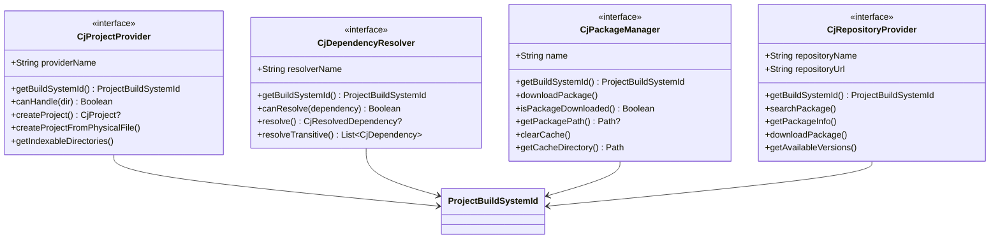

### 6.2 ExtensionPoint 定义

| 扩展点                    | ID                                                   | 实现类 (cjpm)               |
|------------------------|------------------------------------------------------|--------------------------|
| `CjProjectProvider`    | `org.cangnova.cangjie.project.projectProvider`       | `CjpmProjectProvider`    |
| `CjDependencyResolver` | `org.cangnova.cangjie.dependency.dependencyResolver` | `CjpmDependencyResolver` |
| `CjPackageManager`     | `org.cangnova.cangjie.dependency.packageManager`     | `CjpmPackageManager`     |
| `CjRepositoryProvider` | `org.cangnova.cangjie.dependency.repositoryProvider` | `CjpmRepositoryProvider` |

### 6.3 ProjectBuildSystemId

```kotlin
interface ProjectBuildSystemId {
    val id: String
    val displayName: String
}

object CjpmBuildSystemId : ProjectBuildSystemId {
    override val id: String = "cjpm"
    override val displayName: String = "CJPM"
}
```

---

## 7. 服务层设计

### 7.1 服务层次结构

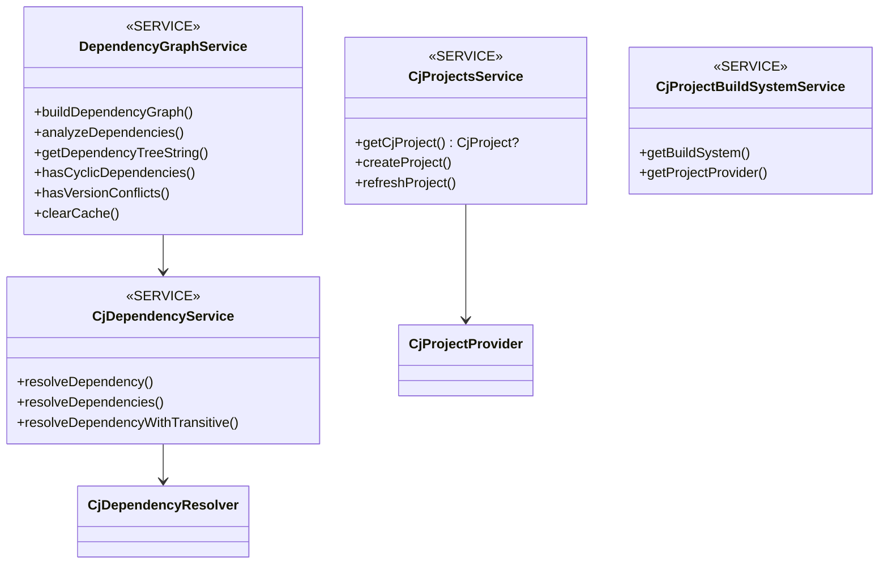

### 7.2 服务级别

| 服务                            | 级别      | 生命周期 | 获取方式                                               |
|-------------------------------|---------|------|----------------------------------------------------|
| `CjProjectsService`           | PROJECT | 项目级  | `project.getService()`                             |
| `CjDependencyService`         | APP     | 应用级  | `ApplicationManager.getApplication().getService()` |
| `DependencyGraphService`      | PROJECT | 项目级  | `project.getService()`                             |
| `CjProjectBuildSystemService` | PROJECT | 项目级  | `project.getService()`                             |

---

## 8. CJPM 实现

### 8.1 CJPM 项目模型实现

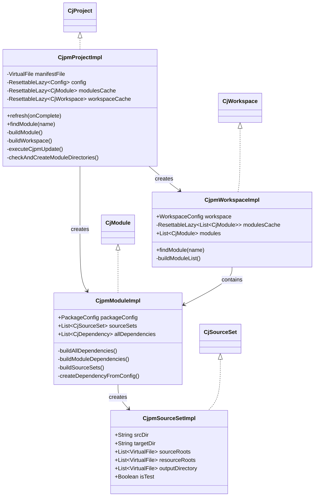

### 8.2 CjpmModuleImpl 依赖解析

**关键方法**：

```kotlin
class CjpmModuleImpl : CjModule {

    // 新设计：统一的依赖列表
    override val allDependencies: List<CjDependency> by lazy {
        buildAllDependencies()
    }

    private fun buildAllDependencies(): List<CjDependency> {
        val manifestFile = configFile ?: return emptyList()
        val config = CjpmTomlParser.parse(manifestFile)
            ?.let { CjpmConfigConverter.convertToSimpleConfig(it) }
            ?: return emptyList()

        val result = mutableListOf<CjDependency>()

        // 解析编译时依赖
        config.dependencies.forEach { (name, depConfig) ->
            result.add(createDependencyFromConfig(name, depConfig, COMPILE))
        }

        // 解析测试依赖
        config.testDependencies.forEach { (name, depConfig) ->
            result.add(createDependencyFromConfig(name, depConfig, TEST))
        }

        return result
    }

    private fun createDependencyFromConfig(
        name: String,
        config: DependencyConfig,
        scope: CjDependencyScope
    ): CjDependency {
        return when {
            config.path != null -> CjDependency.Path(...)
                config.git != null
            -> CjDependency.Git(...)
            else -> CjDependency.Library(...)
        }
    }
}
```

### 8.3 CJPM 配置解析

#### 8.3.1 配置模型

**⚠️ 注意：存在两套 DependencyConfig 定义**

1. **完整版** (`cjpm/config/toml/DependencyConfig.kt`)
   ```kotlin
   data class DependencyConfig(
       val version: String?,
       val path: String?,
       val git: String?,
       val branch: String?,
       val tag: String?,
       val commitId: String?  // ← 使用 commitId
   )
   ```

2. **简化版** (`cjpm/model/CjpmTomlConfig.kt`)
   ```kotlin
   data class DependencyConfig(
       val version: String?,
       val path: String?,
       val git: String?,
       val branch: String?,
       val tag: String?,
       val rev: String?  // ← 使用 rev
   )
   ```

#### 8.3.2 配置转换流程

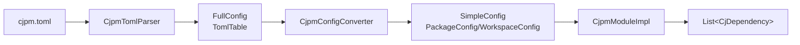

---

## 9. 数据流和交互

### 9.1 项目打开流程

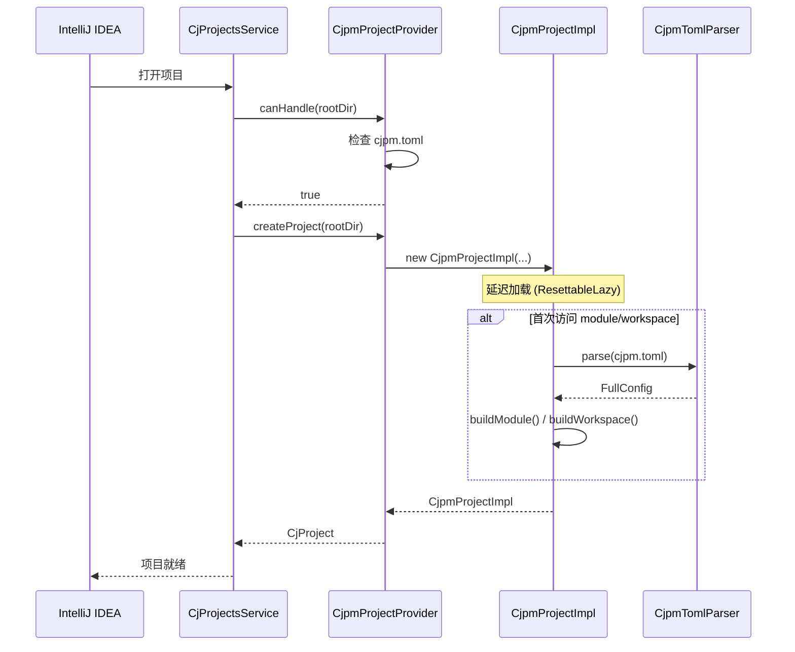

### 9.2 依赖解析流程

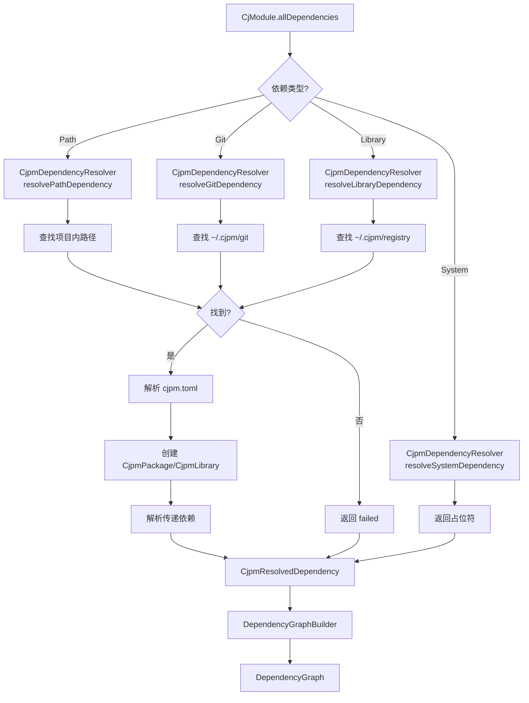

### 9.3 项目刷新流程

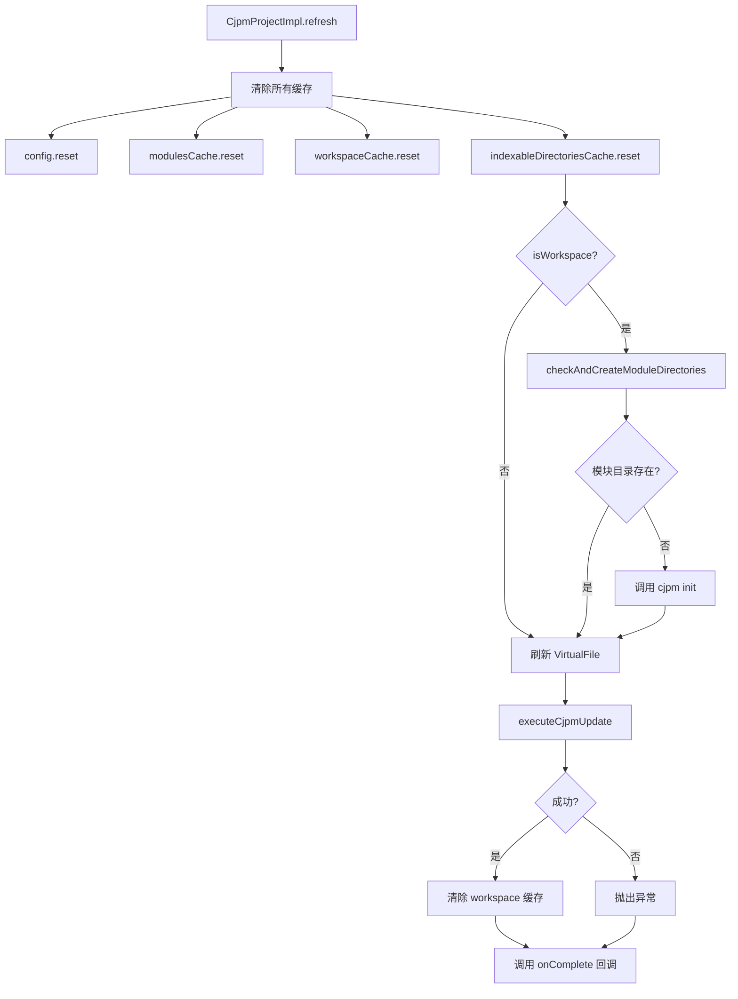

## 11. 实现状态

### 11.1 已完成功能 ✅

| 功能                           | 状态   | 文件                                          |
|------------------------------|------|---------------------------------------------|
| **依赖模型** (Sealed Class)      | ✅ 完成 | `model/CjDependency.kt`                     |
| **CjModule.allDependencies** | ✅ 完成 | `project/model/CjModule.kt`                 |
| **CjpmDependencyResolver**   | ✅ 完成 | `cjpm/dependency/CjpmDependencyResolver.kt` |
| **Path 依赖解析**                | ✅ 完成 | 同上                                          |
| **Git 依赖解析**                 | ✅ 完成 | 同上 (依赖 cjpm update)                         |
| **Library 依赖解析**             | ✅ 完成 | 同上 (依赖 cjpm update)                         |
| **System 依赖解析**              | ✅ 完成 | 同上                                          |
| **传递依赖解析**                   | ✅ 完成 | 同上 (一层)                                     |
| **依赖图构建**                    | ✅ 完成 | `model/impl/DependencyGraphImpl.kt`         |
| **循环依赖检测**                   | ✅ 完成 | 同上                                          |
| **版本冲突解决**                   | ✅ 完成 | 同上                                          |
| **DependencyGraphService**   | ✅ 完成 | `service/DependencyGraphService.kt`         |
| **依赖分析报告**                   | ✅ 完成 | 同上                                          |
| **CJPM 配置解析**                | ✅ 完成 | `cjpm/config/`, `cjpm/project/model/toml/`  |
| **项目模型实现**                   | ✅ 完成 | `cjpm/project/CjpmProjectImpl.kt` 等         |

### 11.2 待改进功能 🚧

| 功能                       | 优先级 | 说明                      |
|--------------------------|-----|-------------------------|
| **主动下载依赖**               | P1  | 当前依赖 `cjpm update` 预先下载 |
| **深度传递依赖**               | P1  | 当前只解析一层传递依赖             |
| **统一 CjDependencyScope** | P0  | 消除重复定义                  |
| **统一 DependencyConfig**  | P1  | 选择标准版本                  |
| **并行依赖解析**               | P2  | 使用协程提升性能                |
| **依赖图可视化UI**             | P2  | 图形化展示依赖关系               |
| **增量依赖解析**               | P2  | 只解析变更的依赖                |
| **依赖缓存优化**               | P2  | 更智能的缓存策略                |

### 11.3 新增文件清单

**核心模型** (cangjie-project):

- `model/DependencyGraph.kt` - 依赖图接口
- `model/impl/DependencyGraphImpl.kt` - 依赖图实现
- `service/DependencyGraphService.kt` - 依赖图服务

**CJPM 实现** (cjpm):

- `dependency/CjpmResolvedDependency.kt` - 解析结果
- `dependency/CjpmPackageImpl.kt` - 包和库实现
- `dependency/CjpmDependencyResolver.kt` - 依赖解析器 (更新)

**已删除文件**:

- ~~`cjpm/project/CjpmDependency.kt`~~ - 不再需要，已合并到 sealed class

---

## 12. 架构优势

### 12.1 设计优点

1. **类型安全**
    - Sealed class 提供编译时类型检查
    - When 表达式详尽性检查

2. **可扩展**
    - ExtensionPoint 支持多构建系统
    - 接口抽象良好，易于实现新的构建系统

3. **性能优化**
    - ResettableLazy 提供缓存和刷新机制
    - 依赖图服务级别缓存
    - 懒加载 (allNodes, uniqueDependencies)

4. **错误处理**
    - CjResolvedDependency 包含详细错误信息
    - 日志记录完善

5. **向后兼容**
    - @Deprecated 保持 API 兼容性
    - 渐进式迁移到新设计

### 12.2 关键技术

| 技术                 | 用途        | 位置                                               |
|--------------------|-----------|--------------------------------------------------|
| **Sealed Class**   | 依赖类型限制    | `CjDependency`                                   |
| **ExtensionPoint** | 构建系统扩展    | `CjProjectProvider`, `CjDependencyResolver` 等    |
| **Service**        | 单例和生命周期管理 | `@Service(Level.PROJECT)`, `@Service(Level.APP)` |
| **ResettableLazy** | 可刷新的懒加载   | `CjpmProjectImpl`                                |
| **DFS 算法**         | 循环检测      | `DependencyGraphImpl.detectCycles()`             |
| **版本比较**           | 冲突解决      | `CjVersion` implements `Comparable`              |

---

## 13. 参考实现对比

### 13.1 Gradle 依赖模型

```
Configuration (api, implementation, testImplementation)
└─ Dependency
    ├─ ModuleDependency (group:name:version)
    ├─ ProjectDependency (project(':module'))
    └─ FileDependency (files('path'))
```

### 13.2 Maven 依赖模型

```
Dependency
├─ groupId
├─ artifactId
├─ version
├─ scope (compile, test, runtime, provided)
├─ type
├─ optional
└─ exclusions
```

### 13.3 Cargo (Rust) 依赖模型

```
Dependency
├─ version (语义化版本)
├─ path (本地路径)
├─ git (Git 仓库)
│   ├─ branch
│   ├─ tag
│   └─ rev
├─ registry (仓库 URL)
├─ features
└─ optional
```

### 13.4 对比总结

| 特性         | Gradle      | Maven | Cargo         | CangJie      |
|------------|-------------|-------|---------------|--------------|
| **类型系统**   | Interface   | POJO  | Enum + Struct | Sealed Class |
| **路径依赖**   | ✅           | ❌     | ✅             | ✅            |
| **Git 依赖** | ❌           | ❌     | ✅             | ✅            |
| **可选依赖**   | ❌ (variant) | ✅     | ✅             | ✅            |
| **传递依赖**   | ✅           | ✅     | ✅             | ✅            |
| **排除规则**   | ✅           | ✅     | ❌             | ✅            |
| **冲突解决**   | 最新版本        | 最近优先  | Lock文件        | 最近优先 + 最新版本  |

CangJie 项目模型吸收了 Gradle、Maven 和 Cargo 的优点，提供了类型安全的 sealed class 设计。

---

## 附录

### A.1 目录结构速查

```
cangjie-project/
├── model/                    # 核心模型 (CjDependency, DependencyGraph)
├── extension/                # 扩展点 (CjDependencyResolver 等)
├── project/model/            # 项目模型 (CjProject, CjModule)
├── project/service/          # 项目服务
├── service/                  # 依赖服务
└── ui/                       # UI 组件

cjpm/
├── dependency/               # 依赖解析实现
├── project/                  # 项目模型实现
├── config/                   # 配置解析
└── toml/                     # TOML 支持
```

### A.2 关键接口速查

| 接口                     | 包                 | 用途                  |
|------------------------|-------------------|---------------------|
| `CjDependency`         | model             | 依赖抽象 (sealed class) |
| `CjProject`            | project.model     | 项目抽象                |
| `CjModule`             | project.model     | 模块抽象                |
| `DependencyGraph`      | model             | 依赖图                 |
| `CjDependencyResolver` | extension         | 依赖解析扩展点             |
| `CjProjectProvider`    | project.extension | 项目提供者扩展点            |

### A.3 服务速查

| 服务                       | 级别      | 获取方式                                                                              |
|--------------------------|---------|-----------------------------------------------------------------------------------|
| `CjProjectsService`      | PROJECT | `project.getService(CjProjectsService::class.java)`                               |
| `CjDependencyService`    | APP     | `ApplicationManager.getApplication().getService(CjDependencyService::class.java)` |
| `DependencyGraphService` | PROJECT | `DependencyGraphService.getInstance(project)`                                     |

---

**文档结束**