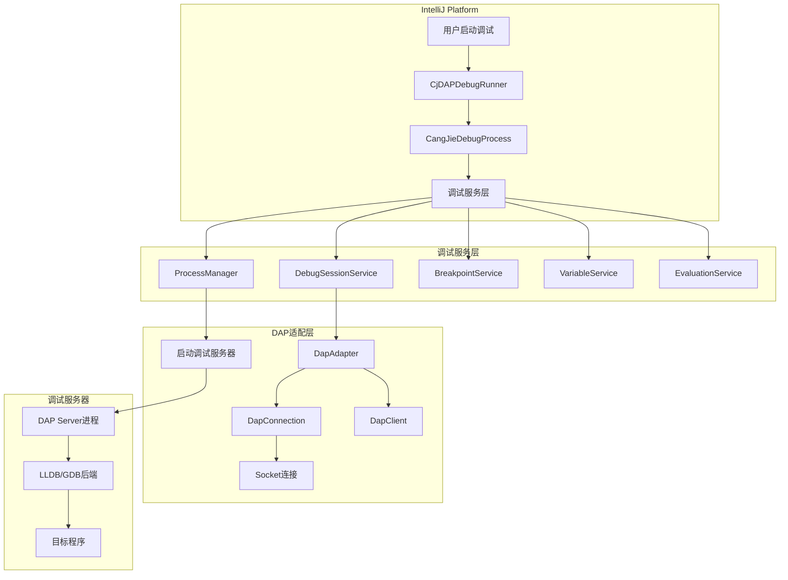
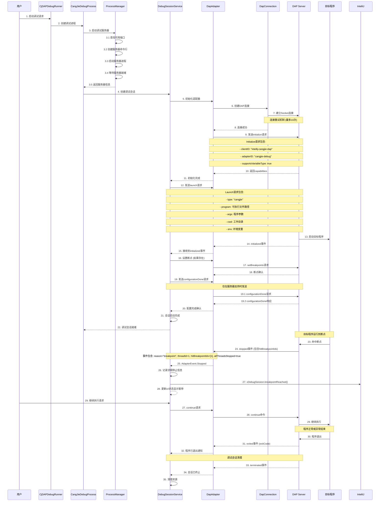
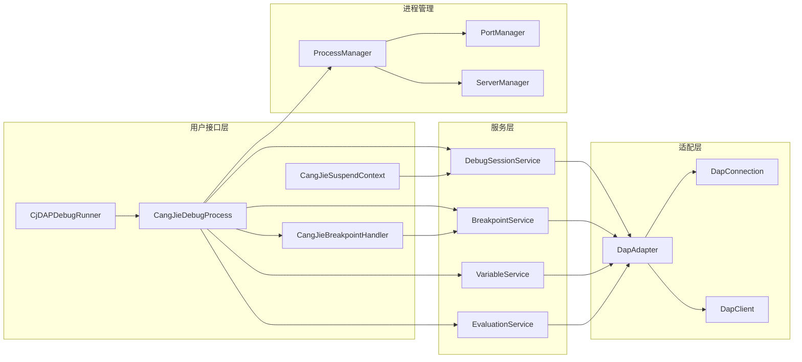
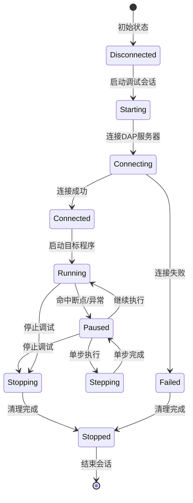
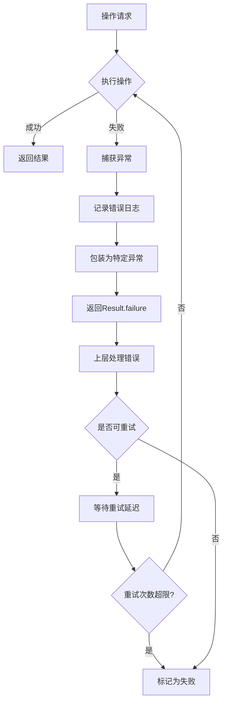

# 仓颉调试器模块连接流程图

## 总体架构概览



## 详细连接流程时序图



## 核心组件交互图



## DAP命令序列表

### 1. 初始化阶段

| 步骤 | 方向      | 命令                | 参数                                |
|----|---------|-------------------|-----------------------------------|
| 1  | 客户端→服务器 | initialize        | clientID, adapterID, capabilities |
| 2  | 服务器→客户端 | initialized       | -                                 |
| 3  | 客户端→服务器 | setBreakpoints    | source, breakpoints (如果存在)        |
| 4  | 客户端→服务器 | configurationDone | - (仅在服务器支持时)                      |
| 5  | 客户端→服务器 | launch/attach     | type, program, args, cwd, env     |

### 2. 断点管理

| 步骤 | 方向      | 命令             | 参数                  |
|----|---------|----------------|---------------------|
| 1  | 客户端→服务器 | setBreakpoints | source, breakpoints |
| 2  | 服务器→客户端 | breakpoint     | reason, breakpoint  |

### 3. 执行控制

| 步骤 | 方向      | 命令        | 参数               |
|----|---------|-----------|------------------|
| 1  | 客户端→服务器 | continue  | threadId         |
| 2  | 服务器→客户端 | continued | threadId         |
| 3  | 服务器→客户端 | stopped   | reason, threadId |

### 4. 单步执行

| 步骤 | 方向      | 命令      | 参数       |
|----|---------|---------|----------|
| 1  | 客户端→服务器 | next    | threadId |
| 2  | 客户端→服务器 | stepIn  | threadId |
| 3  | 客户端→服务器 | stepOut | threadId |

### 5. 变量查看

| 步骤 | 方向      | 命令         | 参数                 |
|----|---------|------------|--------------------|
| 1  | 客户端→服务器 | stackTrace | threadId           |
| 2  | 客户端→服务器 | scopes     | frameId            |
| 3  | 客户端→服务器 | variables  | variablesReference |

### 6. 表达式求值

| 步骤 | 方向      | 命令       | 参数                              |
|----|---------|----------|---------------------------------|
| 1  | 客户端→服务器 | evaluate | expression, frameId, context    |
| 2  | 服务器→客户端 | result   | value, type, variablesReference |

### 7. 程序退出处理

| 步骤 | 方向      | 事件         | 参数       |
|----|---------|------------|----------|
| 1  | 服务器→客户端 | exited     | exitCode |
| 2  | 服务器→客户端 | terminated | -        |

### 8. 断开连接

| 步骤 | 方向      | 命令         | 参数                |
|----|---------|------------|-------------------|
| 1  | 客户端→服务器 | disconnect | terminateDebuggee |

## 连接状态转换图



## 关键配置参数

### 连接配置

```kotlin
ConnectionConfig(
    maxRetries: Int = 10,        // 最大重试次数
    retryDelayMs: Long = 500,    // 重试间隔
    connectionTimeoutMs: Long = 5000  // 连接超时
)
```

### 服务器配置

```kotlin
ServerConfig(
    portRange: IntRange = 4711..4741,  // 端口范围
    startupTimeoutMs: Long = 10000,    // 启动超时
    debuggerType: String = "lldb"      // 调试器类型
)
```

### 适配器配置

```kotlin
AdapterConfig(
    host: String = "localhost",    // 服务器地址
    port: Int,                     // 服务器端口
    connectionConfig: ConnectionConfig
)
```

## 错误处理流程



## 性能优化要点

1. **连接复用**: DAP连接在整个调试会话中保持活跃
2. **异步操作**: 所有DAP命令都使用异步调用避免阻塞
3. **连接池**: 支持多个调试会话并发执行
4. **事件驱动**: 使用事件模式处理调试事件，减少轮询
5. **资源管理**: 及时清理进程和连接资源

## 调试信息输出

调试过程中的关键日志信息：

- `CjDAPDebugRunner`: 开始调试程序路径
- `ProcessManager`: 调试服务器启动/停止信息
- `DapConnection`: 连接建立/重试信息
- `DapAdapter`: DAP命令发送/响应信息
- `DapClient`: 调试事件接收信息

这个调试器模块采用了分层的架构设计，通过DAP协议实现了与各种调试后端的标准接口，支持完整的调试功能包括断点管理、单步执行、变量查看和表达式求值。

## ConfigurationDone命令的重要性

**修复说明**: 原始实现中缺少了关键的`configurationDone`命令，这会导致某些DAP服务器无法正确启动调试会话。

### 为什么需要configurationDone?

1. **DAP协议规范要求**: 根据Debug Adapter Protocol官方规范，`configurationDone`是初始化流程的必要步骤
2. **服务器兼容性**: 许多DAP服务器（如LLDB、GDB适配器）依赖此命令来确认所有配置已完成
3. **断点设置时机**: 确保在目标程序开始执行前所有断点都已正确设置
4. **错误处理**: 提供配置错误的早期检测和报告

### 修复后的正确流程

1. **initialize** - 初始化DAP会话
2. **initialized事件** - 服务器确认初始化完成
3. **setBreakpoints** (可选) - 设置初始断点
4. **configurationDone** (条件性) - 告知服务器配置已完成
5. **launch/attach** - 启动或附加到目标程序

### 实现要点

- 根据服务器的`capabilities.supportsConfigurationDoneRequest`判断是否需要发送此命令
- 在接收到`initialized`事件后发送，确保服务器已准备就绪
- 异步处理，避免阻塞调试会话启动流程
- 完善的错误处理和日志记录

## Exited事件处理的重要性

**修复说明**: 原始实现中缺少了`AdapterEvent.Exited`事件的处理，这会导致无法正确响应目标程序的退出状态。

### Exited vs Terminated的区别

1. **exited事件**: 表示目标程序已经退出，包含退出码
    - 正常退出: exitCode = 0
    - 异常退出: exitCode ≠ 0
    - 此时调试会话可能仍然活跃

2. **terminated事件**: 表示整个调试会话已经结束
    - 通常在exited事件之后发生
    - 调试服务器准备断开连接

### 实现要点

- **退出码分析**: 根据exitCode判断程序是正常完成还是异常退出
- **日志记录**: 详细记录退出原因和退出码
- **UI通知**: 通过Output事件向用户显示退出信息
- **资源清理**: 在terminated事件中清理所有会话资源
- **事件顺序**: 确保按exited→terminated的顺序处理事件

### 事件处理流程

1. 接收`exited`事件，记录退出码
2. 根据退出码判断程序执行结果
3. 向用户发送退出通知
4. 接收`terminated`事件，清理会话资源
5. 更新调试状态为已停止