# Descriptors 模块

## 一、模块概述

Descriptors 模块是仓颉语言 IntelliJ 插件的**语义模型核心**，负责将源代码的语法结构（PSI）转换为语义模型（Descriptors），为代码分析、类型检查、引用解析等上层功能提供基础支持。


```
┌─────────────────────────────────────────────────────────────────────────────┐
│                            IDE 功能层                                        │
│            代码补全 │ 引用解析 │ 重构 │ 检查 │ 导航 │ 类型推断               │
└─────────────────────────────────────────────────────────────────────────────┘
                                    ▲
                                    │ 查询语义信息
                                    │
┌─────────────────────────────────────────────────────────────────────────────┐
│                        Descriptors 模块 (本模块)                             │
│  ┌─────────────┐  ┌─────────────┐  ┌─────────────┐  ┌─────────────────────┐ │
│  │ Descriptors │  │   Types     │  │   Scopes    │  │   Deserialization   │ │
│  │  声明描述符  │  │  类型系统   │  │  作用域解析  │  │   元数据反序列化     │ │
│  │  (~170文件) │  │  (~70文件)  │  │  (~50文件)  │  │     (32文件)        │ │
│  └─────────────┘  └─────────────┘  └─────────────┘  └─────────────────────┘ │
└─────────────────────────────────────────────────────────────────────────────┘
                                    ▲
                                    │ 构建 / 反序列化
┌───────────────────────────────────┴─────────────────────────────────────────┐
│              PSI 模块                              Metadata 模块             │
│            (语法树结构)                          (.cjo 元数据文件)            │
└─────────────────────────────────────────────────────────────────────────────┘
```

---

## 二、核心概念

### 2.1 什么是 Descriptor？

Descriptor（描述符）是程序元素的**语义抽象表示**，与 PSI（语法树节点）形成互补：

```
┌──────────────────────────────────────────────────────────────────┐
│                        源代码文件                                 │
│  class MyClass<T> {                                              │
│      func process(item: T): String { ... }                       │
│  }                                                               │
└──────────────────────────────────────────────────────────────────┘
                    │                           │
        ┌───────────┴───────────┐   ┌───────────┴───────────┐
        ▼                       ▼   ▼                       ▼
┌───────────────────┐      ┌───────────────────────────────────────┐
│       PSI         │      │            Descriptor                 │
├───────────────────┤      ├───────────────────────────────────────┤
│ • 语法结构        │      │ • 语义信息                             │
│ • 文本位置        │      │ • 类型关系                             │
│ • 空白和注释      │      │ • 继承层次                             │
│ • 仅源代码        │      │ • 源代码 + 二进制库                    │
├───────────────────┤      ├───────────────────────────────────────┤
│ 用途:             │      │ 用途:                                 │
│ 语法高亮、格式化   │      │ 类型检查、引用解析、代码补全           │
└───────────────────┘      └───────────────────────────────────────┘
```

### 2.2 核心特性对比

| 特性 | PSI | Descriptor |
|------|-----|------------|
| **关注点** | 语法结构、文本位置 | 语义信息、类型关系 |
| **生命周期** | 随编辑器变化 | 可缓存、可序列化 |
| **数据来源** | 仅源代码 | 源代码 + 二进制库 |
| **主要用途** | 语法高亮、格式化 | 类型检查、引用解析 |
| **可变性** | 可变 | 不可变（替换产生新实例） |

---

## 三、模块架构

### 3.1 目录结构总览

```
descriptors/
│
├── src/main/kotlin/org/cangnova/cangjie/
│   │
│   ├── builtins/                    # 内置库管理 (6 文件)
│   │   ├── CangJieBuiltIns.kt           # 内置库入口，提供基本类型访问
│   │   ├── BuiltInsLoader.kt            # 内置库加载器接口
│   │   ├── BuiltInsPackageFragment.kt   # 内置库包片段接口
│   │   ├── UnsignedType.kt              # 无符号类型处理
│   │   ├── basic/                       # 基本类型 (Int, Bool, String...)
│   │   │   └── BasicTypesPackageFragmentProvider.kt
│   │   └── builtinstype/                # 内置类型 (Array, Option...)
│   │       └── BuiltinsTypesPackageFragmentProvider.kt
│   │
│   ├── descriptors/                 # 核心描述符系统 (~170 文件)
│   │   ├── [核心接口]                   # DeclarationDescriptor, Named 等
│   │   ├── [分类器]                     # ClassDescriptor, TypeParameterDescriptor 等
│   │   ├── [可调用]                     # FunctionDescriptor, PropertyDescriptor 等
│   │   ├── [模块/包]                    # ModuleDescriptor, PackageFragmentDescriptor 等
│   │   ├── annotations/             # 注解系统 (9 文件)
│   │   ├── extend/                  # 扩展描述符 (2 文件)
│   │   ├── impl/                    # 具体实现 (~70 文件)
│   │   ├── macro/                   # 宏描述符 (2 文件)
│   │   └── synthetic/               # 合成描述符 (1 文件)
│   │
│   ├── resolve/                     # 符号解析系统 (~50 文件)
│   │   ├── [工具类]                     # DescriptorUtils, OverridingUtil 等
│   │   ├── scopes/                  # 作用域实现 (25 文件)
│   │   │   ├── [核心作用域]              # MemberScope, ResolutionScope 等
│   │   │   ├── [特殊作用域]              # BuiltInsMemberScope, FunctionClassScope 等
│   │   │   ├── receivers/           # 接收者 (8 文件)
│   │   │   └── extend/              # 扩展作用域 (1 文件)
│   │   ├── constants/               # 常量系统 (8 文件)
│   │   ├── call/inference/          # 类型推断 (1 文件)
│   │   └── extend/                  # 扩展管理 (2 文件)
│   │
│   ├── types/                       # 类型系统 (~70 文件)
│   │   ├── [类型核心]                   # CangJieType, TypeConstructor 等
│   │   ├── [类型操作]                   # TypeSubstitutor, TypeUtils 等
│   │   ├── checker/                 # 类型检查器 (13 文件)
│   │   ├── error/                   # 错误类型 (11 文件)
│   │   └── expressions/             # 表达式类型
│   │
│   ├── renderer/                    # 描述符渲染 (4 文件)
│   ├── incremental/                 # 增量编译支持
│   └── util/                        # 工具函数
│
└── deserialization/                 # 反序列化子模块 (32 文件)
    └── src/main/kotlin/.../deserialization/
        ├── [反序列化器]                 # ClassDeserializer, TypeDeserializer 等
        ├── [数据查找]                   # ClassDataFinder, FullIdFinder 等
        ├── builtins/                # 内置库反序列化 (2 文件)
        └── descriptors/             # 反序列化描述符 (9 文件)
```

### 3.2 描述符继承体系

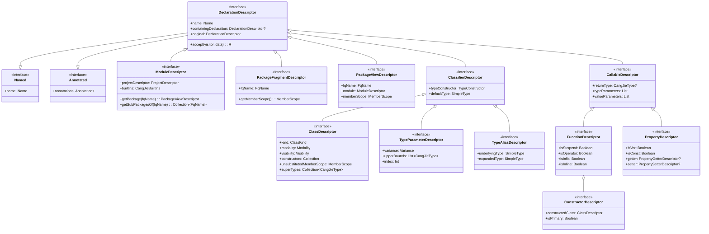

### 3.3 类型系统架构

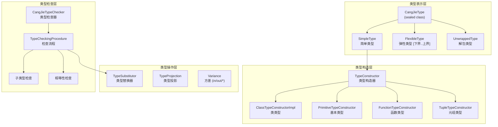

### 3.4 作用域解析架构

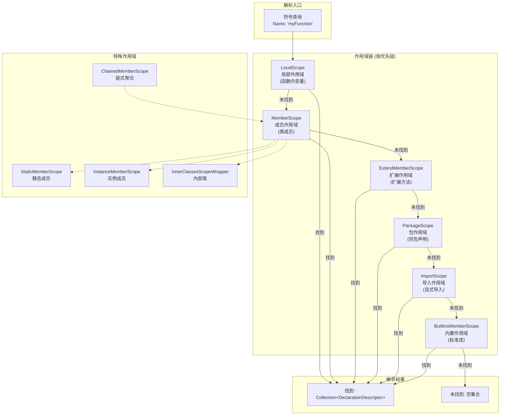

---

## 四、核心组件详解

### 4.1 Descriptors 包 - 声明描述符

#### 4.1.1 核心接口层

| 接口 | 职责 | 关键属性/方法 |
|------|------|---------------|
| `DeclarationDescriptor` | 所有描述符的根接口 | `name`, `containingDeclaration`, `original` |
| `Named` | 具有名称的元素 | `name: Name` |
| `Annotated` | 可添加注解的元素 | `annotations: Annotations` |
| `ValidateableDescriptor` | 可验证的描述符 | `validate()` |

#### 4.1.2 分类器描述符

```
ClassifierDescriptor (分类器基接口)
    │
    ├── ClassDescriptor (类/接口/结构体)
    │   ├── kind: ClassKind (CLASS, INTERFACE, ENUM, STRUCT...)
    │   ├── modality: Modality (FINAL, OPEN, ABSTRACT, SEALED)
    │   ├── constructors: Collection<ClassConstructorDescriptor>
    │   ├── unsubstitutedMemberScope: MemberScope
    │   └── superTypes: Collection<CangJieType>
    │
    ├── TypeParameterDescriptor (类型参数 <T>)
    │   ├── variance: Variance (IN, OUT, INVARIANT)
    │   ├── upperBounds: List<CangJieType>
    │   └── index: Int
    │
    └── TypeAliasDescriptor (类型别名 typealias)
        ├── underlyingType: SimpleType
        └── expandedType: SimpleType
```

#### 4.1.3 可调用描述符

```
CallableDescriptor (可调用基接口)
    │
    ├── FunctionDescriptor (函数)
    │   ├── valueParameters: List<ValueParameterDescriptor>
    │   ├── returnType: CangJieType?
    │   ├── typeParameters: List<TypeParameterDescriptor>
    │   ├── isSuspend / isOperator / isInfix / isInline
    │   │
    │   └── ConstructorDescriptor (构造函数)
    │       ├── constructedClass: ClassDescriptor
    │       └── isPrimary: Boolean
    │
    └── PropertyDescriptor (属性)
        ├── isVar: Boolean
        ├── isConst: Boolean
        ├── getter: PropertyGetterDescriptor?
        └── setter: PropertySetterDescriptor?
```

#### 4.1.4 模块与包描述符

```
项目/模块层次结构:

ProjectDescriptor (项目)
    │
    └── ModuleDescriptor (模块)
            │
            ├── PackageViewDescriptor (包视图 - 聚合视图)
            │   └── memberScope: MemberScope
            │
            └── PackageFragmentDescriptor (包片段 - 单个来源)
                └── getMemberScope(): MemberScope
```

#### 4.1.5 实现类分布 (impl 目录)

| 类别 | 主要实现类 | 数量 |
|------|-----------|------|
| **类相关** | `ClassDescriptorImpl`, `EnumDescriptorImpl`, `PrimitiveClassDescriptor`, `TupleClassDescriptor`, `FunctionClassDescriptor` | ~15 |
| **函数相关** | `SimpleFunctionDescriptorImpl`, `FunctionDescriptorImpl`, `AnonymousFunctionDescriptor`, `ClassConstructorDescriptorImpl` | ~8 |
| **属性相关** | `PropertyDescriptorImpl`, `PropertyGetterDescriptorImpl`, `PropertySetterDescriptorImpl`, `LocalVariableDescriptor` | ~10 |
| **参数相关** | `ValueParameterDescriptorImpl`, `ReceiverParameterDescriptorImpl`, `TypeParameterDescriptorImpl` | ~8 |
| **模块/包相关** | `ModuleDescriptorImpl`, `PackageFragmentDescriptorImpl`, `LazyPackageViewDescriptorImpl` | ~10 |
| **其他** | `DeclarationDescriptorImpl`, `TypeAliasConstructorDescriptorImpl` 等 | ~20 |

### 4.2 Types 包 - 类型系统

#### 4.2.1 类型层次

```
CangJieType (sealed class - 所有类型的基类)
    │
    ├── SimpleType (简单类型)
    │   ├── constructor: TypeConstructor     # 类型构造器
    │   ├── arguments: List<TypeProjection>  # 类型参数
    │   ├── isMarkedNullable: Boolean       # 可空标记
    │   └── memberScope: MemberScope         # 成员作用域
    │
    ├── FlexibleType (弹性类型)
    │   ├── lowerBound: SimpleType          # 下界
    │   └── upperBound: SimpleType          # 上界
    │
    └── UnwrappedType (解包类型)
```

#### 4.2.2 类型构造器体系

```
TypeConstructor (类型构造器接口)
    │
    ├── ClassTypeConstructorImpl         # 普通类类型
    ├── PrimitiveTypeConstructor         # 基本类型 (Int, String...)
    ├── EnumTypeConstructor              # 枚举类型
    ├── FunctionTypeConstructor          # 函数类型 (P1, P2) -> R
    ├── TupleTypeConstructor             # 元组类型 (T1, T2, ...)
    ├── BuiltInsTypeConstructor          # 内置类型
    ├── IntersectionTypeConstructor      # 交集类型 A & B
    └── ErrorTypeConstructor             # 错误类型
```

#### 4.2.3 类型检查器

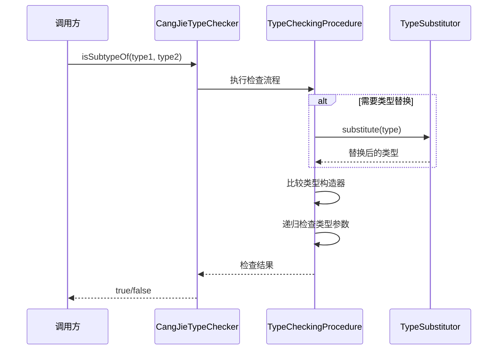

#### 4.2.4 错误类型系统 (60+ 种错误类型)

| 错误类别 | 示例 | 说明 |
|----------|------|------|
| **未解析类型** | `UNRESOLVED_TYPE`, `UNRESOLVED_CLASS_TYPE` | 无法解析的类型引用 |
| **返回类型错误** | `RETURN_TYPE_FOR_FUNCTION`, `IMPLICIT_RETURN_TYPE` | 函数返回类型问题 |
| **循环类型** | `RECURSIVE_TYPE`, `CYCLIC_SUPERTYPES` | 类型定义循环 |
| **类型推断** | `UNINFERRED_TYPE_VARIABLE`, `UNINFERRED_LAMBDA_PARAMETER` | 无法推断的类型 |
| **反序列化** | `CANNOT_LOAD_DESERIALIZE_TYPE_PARAMETER` | 元数据加载失败 |

### 4.3 Resolve 包 - 符号解析

#### 4.3.1 作用域类型

| 作用域 | 用途 | 实现类 |
|--------|------|--------|
| **成员作用域** | 类/包的成员查找 | `MemberScopeImpl` |
| **静态作用域** | 静态成员查找 | `StaticMemberScope` |
| **实例作用域** | 实例成员查找 | `InstanceMemberScope` |
| **内置作用域** | 内置类型成员 | `BuiltInsMemberScope` |
| **基本类型作用域** | Int/String 等的成员 | `PrimitiveMemberScope` |
| **函数类型作用域** | 函数类型的 invoke | `FunctionClassScope` |
| **元组作用域** | 元组的成员访问 | `TupleClassScope` |
| **扩展作用域** | 扩展方法 | `ExtendMemberScope` |
| **链式作用域** | 多作用域聚合 | `ChainedMemberScope` |
| **替换作用域** | 类型参数替换后 | `SubstitutingScope` |
| **错误作用域** | 错误处理 | `ErrorScope` |

#### 4.3.2 接收者类型

```
ReceiverValue (接收者值接口)
    │
    ├── ImplicitReceiver           # 隐式接收者 (this)
    │   ├── ImplicitClassReceiver  # 类的隐式接收者
    │   └── ContextClassReceiver   # 上下文接收者
    │
    ├── ExtensionReceiver          # 扩展接收者
    │
    └── TransientReceiver          # 临时接收者
```

#### 4.3.3 常量系统

```
CompileTimeConstant (编译时常量)
    │
    ├── IntValue, LongValue, ShortValue, ByteValue
    ├── UIntValue, ULongValue, UShortValue, UByteValue
    ├── FloatValue, DoubleValue
    ├── BoolValue
    ├── StringValue, RuneValue
    ├── NullValue
    └── ArrayValue, EnumValue
```

### 4.4 Deserialization 子模块 - 元数据反序列化

#### 4.4.1 反序列化流程

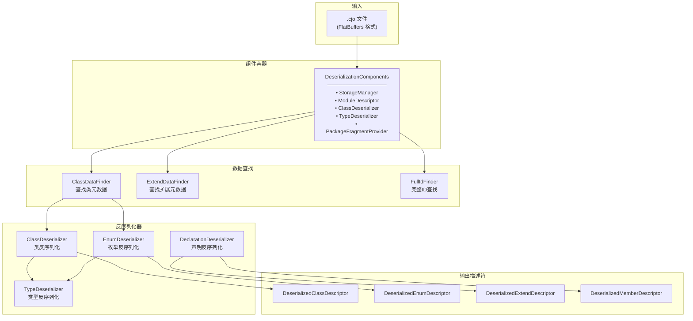

#### 4.4.2 核心组件

| 组件 | 职责 |
|------|------|
| `DeserializationComponents` | 反序列化系统的全局配置和组件容器 |
| `DeserializationContext` | 反序列化过程中的局部上下文 |
| `ClassDeserializer` | 类的反序列化 |
| `EnumDeserializer` | 枚举的反序列化 |
| `TypeDeserializer` | 类型的反序列化 |
| `DeclarationDeserializer` | 通用声明的反序列化 |
| `BuiltInSerializerFlatbuffers` | 内置库文件定位和加载 |

---

## 五、设计模式与原则

### 5.1 分离语法与语义

```
┌─────────────────┐
│   源代码文本     │
└────────┬────────┘
         │ 词法/语法分析
         ▼
┌─────────────────┐
│      PSI        │  ◄── 语法层：结构和位置
└────────┬────────┘
         │ 语义分析
         ▼
┌─────────────────┐
│   Descriptors   │  ◄── 语义层：类型和含义
└─────────────────┘
```

**优势**：
- PSI 变化时，Descriptor 可增量更新
- 二进制库无需源代码，直接反序列化为 Descriptor
- 语义分析独立于具体语法

### 5.2 延迟计算 (Lazy Evaluation)

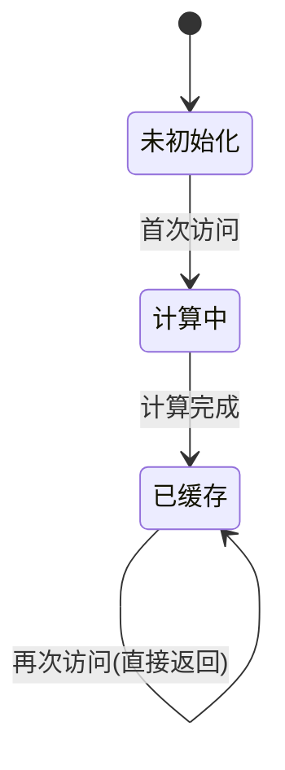

- 属性（类型、成员列表等）仅在首次访问时计算
- 使用 `StorageManager` 管理缓存
- 避免不必要的计算开销
- 支持递归类型的处理

### 5.3 不可变性 (Immutability)

```
┌───────────────────────────────────────┐
│          原始 Descriptor              │
│   class Box<T> { ... }               │
└───────────────────────────────────────┘
                   │
     ┌─────────────┼─────────────┐
     ▼             ▼             ▼
┌─────────┐  ┌─────────┐  ┌─────────┐
│ Box<Int>│  │Box<Str> │  │Box<Bool>│
└─────────┘  └─────────┘  └─────────┘
   (类型参数替换产生新的描述符实例)
```

- Descriptor 创建后不可修改
- 类型参数替换产生新实例
- 保证线程安全
- 便于缓存和共享

### 5.4 访问者模式 (Visitor Pattern)

```kotlin
interface DeclarationDescriptorVisitor<R, D> {
    fun visitModuleDeclaration(descriptor: ModuleDescriptor, data: D): R
    fun visitClassDescriptor(descriptor: ClassDescriptor, data: D): R
    fun visitFunctionDescriptor(descriptor: FunctionDescriptor, data: D): R
    fun visitPropertyDescriptor(descriptor: PropertyDescriptor, data: D): R
    fun visitConstructorDescriptor(descriptor: ConstructorDescriptor, data: D): R
    fun visitTypeParameterDescriptor(descriptor: TypeParameterDescriptor, data: D): R
    // ... 更多访问方法
}
```

### 5.5 统一的二进制/源码模型

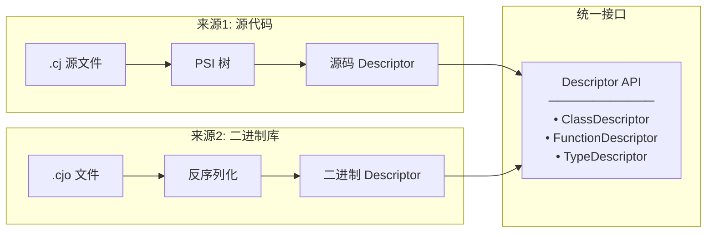

---

## 六、关键工作流

### 6.1 类型检查流程

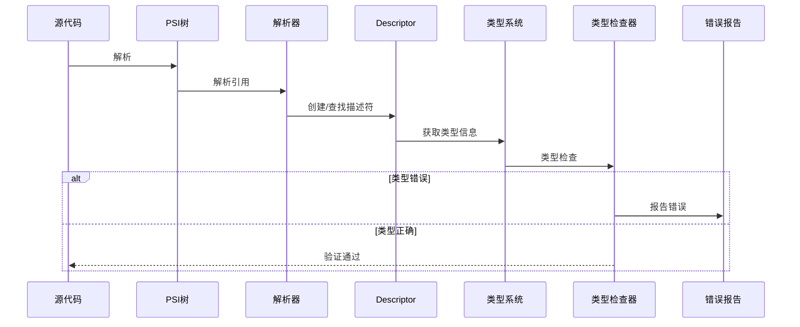

### 6.2 符号解析流程

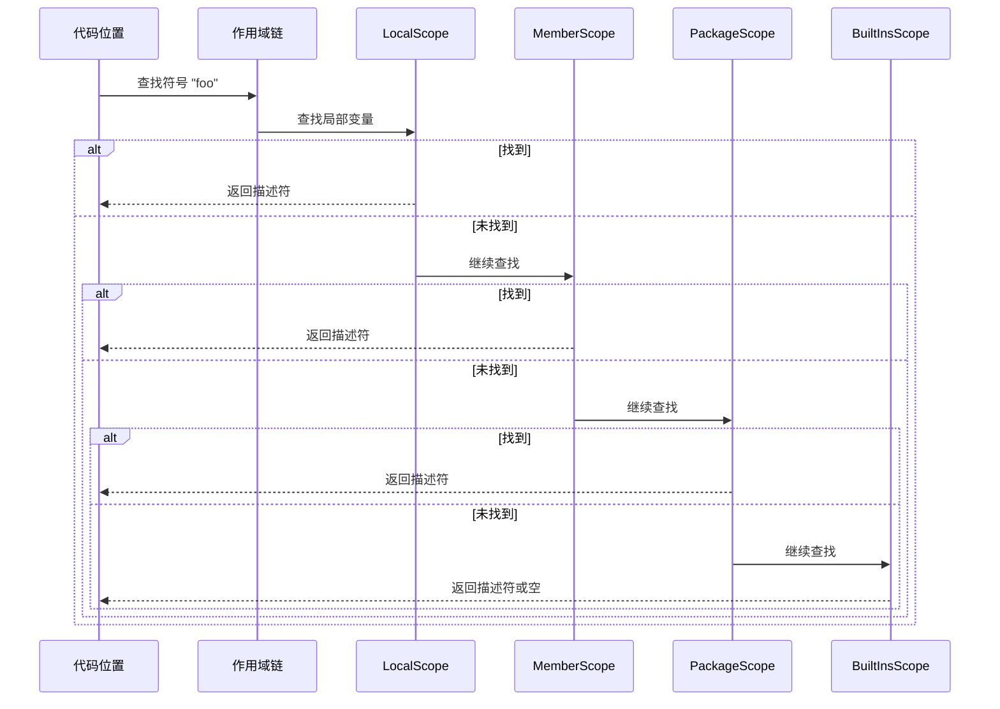

### 6.3 反序列化流程

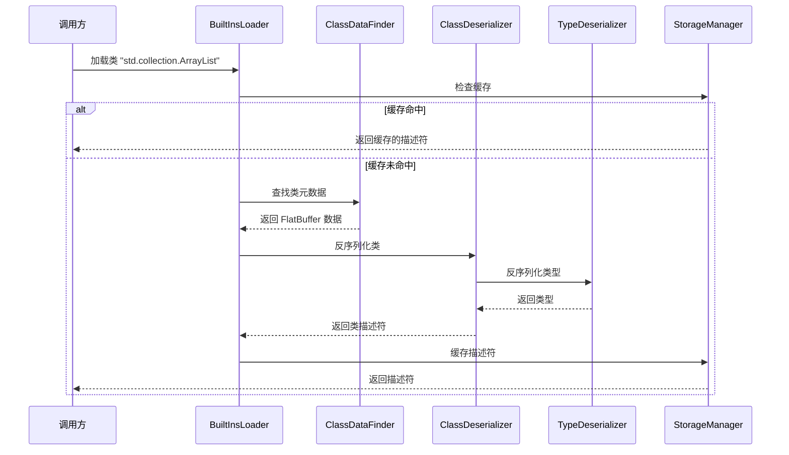

---

## 七、内置类型支持

### 7.1 基本类型

| 类型 | 描述符类 | 说明 |
|------|----------|------|
| `Int8`, `Int16`, `Int32`, `Int64` | `PrimitiveClassDescriptor` | 有符号整数 |
| `UInt8`, `UInt16`, `UInt32`, `UInt64` | `PrimitiveClassDescriptor` | 无符号整数 |
| `Float16`, `Float32`, `Float64` | `PrimitiveClassDescriptor` | 浮点数 |
| `Bool` | `PrimitiveClassDescriptor` | 布尔类型 |
| `Rune` | `PrimitiveClassDescriptor` | Unicode 字符 |
| `String` | `PrimitiveClassDescriptor` | 字符串 |
| `Unit` | `PrimitiveClassDescriptor` | 单元类型 |
| `Nothing` | `PrimitiveClassDescriptor` | 底类型 |

### 7.2 特殊类型

| 类型 | 描述 |
|------|------|
| `Any` | 所有类型的父类型 |
| `Nothing` | 所有类型的子类型（底类型） |
| `Option<T>` | 可空类型，等价于 `T?` |
| `Array<T>` | 数组类型 |
| `Function<P..., R>` | 函数类型 |
| `Tuple<T...>` | 元组类型 |

### 7.3 标准库包结构

```
std
├── core          # 核心类型
├── collection    # 集合类型
│   └── concurrent
├── io            # 输入输出
├── fs            # 文件系统
├── net           # 网络
├── sync          # 并发同步
├── time          # 时间日期
├── math          # 数学函数
├── regex         # 正则表达式
├── reflect       # 反射
├── unittest      # 单元测试
└── ...           # 更多模块
```

---

## 八、与其他模块的关系

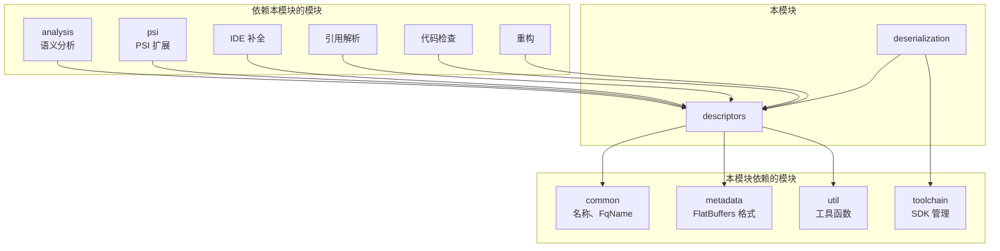

---

## 九、扩展指南

### 9.1 添加新的描述符类型

1. 在 `descriptors/` 下定义接口，继承 `DeclarationDescriptor`
2. 在 `descriptors/impl/` 下创建实现类
3. 在 `DeclarationDescriptorVisitor` 中添加访问方法
4. 如需反序列化支持，在 `deserialization/` 中添加反序列化器

### 9.2 添加新的内置类型

1. 在 `common` 模块的 `StandardNames` 中定义名称常量
2. 在 `CangJieBuiltIns` 中添加访问方法
3. 在 `BuiltinsTypesPackageFragmentProvider` 中注册

### 9.3 添加新的作用域类型

1. 实现 `MemberScope` 或继承 `MemberScopeImpl`
2. 实现 `getContributedFunctions()` 和 `getContributedVariables()`
3. 在适当的描述符中使用新作用域

---

## 十、文件统计

| 目录 | 文件数 | 说明 |
|------|--------|------|
| `builtins/` | 6 | 内置库管理 |
| `descriptors/` | ~170 | 核心描述符系统 |
| ├── `annotations/` | 9 | 注解系统 |
| ├── `extend/` | 2 | 扩展系统 |
| ├── `impl/` | ~70 | 具体实现 |
| ├── `macro/` | 2 | 宏系统 |
| └── `synthetic/` | 1 | 合成元素 |
| `resolve/` | ~50 | 符号解析 |
| ├── `scopes/` | 25 | 作用域系统 |
| ├── `constants/` | 8 | 常量系统 |
| └── 其他 | 17 | 工具函数 |
| `types/` | ~70 | 类型系统 |
| ├── `checker/` | 13 | 类型检查 |
| ├── `error/` | 11 | 错误类型 |
| └── 其他 | ~46 | 类型操作 |
| `renderer/` | 4 | 描述符渲染 |
| `deserialization/` | 32 | 反序列化 |
| **总计** | **~292** | |